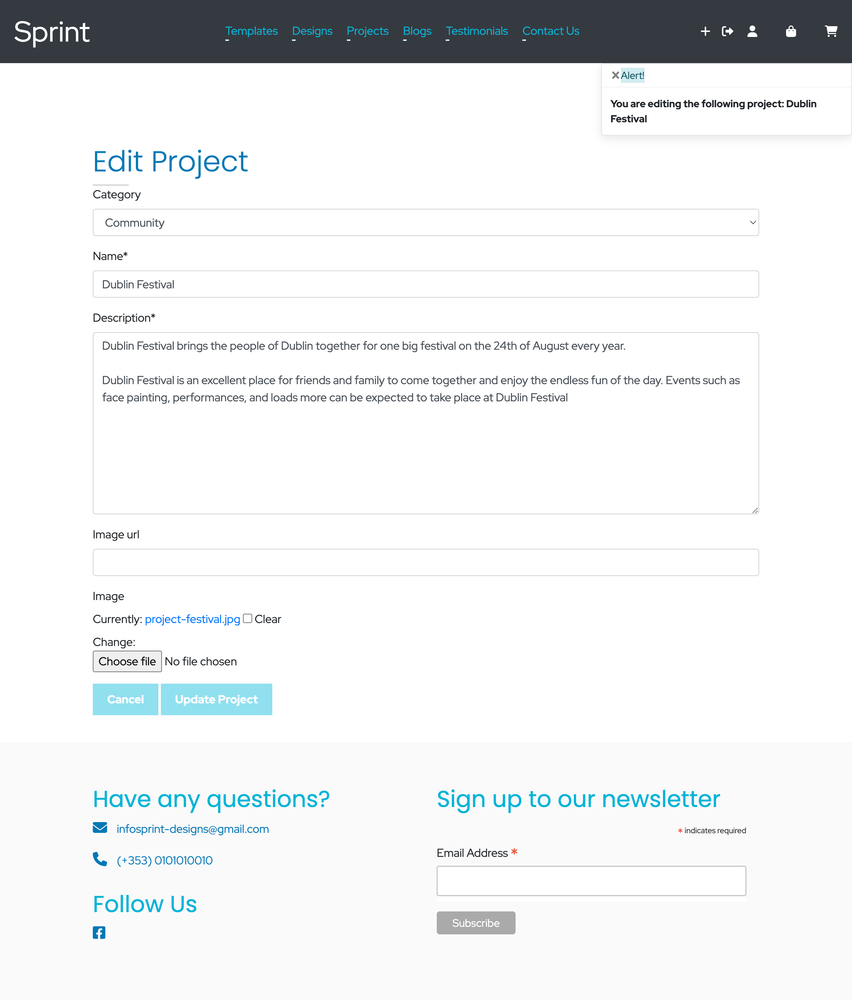
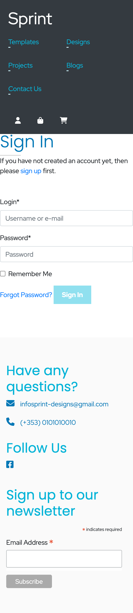

# Sprint Designs

## Introduction
- Sprint Designs is a fully responsive e-commerce site built using Django. Sprint Designs is a fictional company based in Dublin that offers a B2B service. Sprint Designs provides businesses with robust and easy to customize web templates, as well as graphic designs completely custom to the businesses needs. Users can purchase templates and designs, view recent projects, read testimonials and also create an account. Site admin have certain privileges such as adding,removing or updating products.

- Sprint Designs is my fifth and final project as part of the Code Institute Full Stack Software Development course. Unfortunately, due to time constraints there are are many of the projects where I wish to have developed better.

* [Live Site](https://sprint-designs.herokuapp.com/)

## Table of Contents

* [User Experience](#Introduction)
    * [Site Goals](#Site-Goals)
    * [User Stories](#User-Stories)
    * [Strategy Plane](#Strategy)
    * [Scope Plane](#Scope)
    * [Structure Plane](#Structure)
    * [Skeleton Plane](#Skeleton)
        * [Wireframes](#wireframes)
        * [Seo](#Seo)
    * [Surface Plane](#Surface)
        * [Design](#Design)
    * [Features](#Features)
    * [Marketing](#Marketing)
    * [Testing](#Testing)
    * [Technologies](#Technologies)
    * [Bugs](#Bugs)
    * [Deployment](#Deployment)
    * [Credits](#Credits)
## UX

### User Stories
### **Admin**
- As a Site Owner, I want to be able to add, update and delete products from the store.

- As a Site Owner, I want to be able to add, update and delete recent projects.

- As a Site Owner, I want to be able to add, update and delete blog posts.

- As a Site Owner, I want to be able to view all reviews when viewing a product, so that I can delete reviews if needed.

### **Registered User**
- As a User, I want to be able to view my account profile, so that I can look at my purchase/order history.

- As a User, I want to be able to register for an account, so that I can store my details.

- As a User, I want to be able to add a review to a product that I have purchased, so that I can share my feedback.

- As a User, I want to be able to view a review form when viewing a product, so that I can add feedback about the product.

### **Default User**
- As a User, I want to be able to view a list of products, so that I can add them to my shopping bag.

- As a User, I want to be able to view an individual product on it's own page, so that I can read the information about the product more clearly.

- As a User, I want to view a error page if I visit a page that does not exist on the site, so that I know to head back to an existing page on the site.

- As a User, I want to be able to sign up to a newsletter, so that I can keep up to date with the business.

- As a User, I want to be able to make an order without needing to create an account, so that I can make one off orders.

- As a User, I want to view a projects page, so that I can view the past work completed by the business.

- As a User, I want to be able to view my shopping bag so that I can add or remove any items.

- As a User, I want to view a contact page, so that I can get in touch with the business directly.

- As a User, I want to view testimonials, so that I can add a new testimonial and read about other peoples experience.

- As a User, I want to view blog posts, so that I can read the blogs posted by the company.

- As a User, I want to view a error page if I visit a page that does not exist so that I know to navigate back to the site.

### Site Goals
- To provide users with a site where they can purchase web templates, and designs to help grow their online presence as a business.

- To promote custom built web templates using efficient code that allows business owners to easily add content to their site.

- To promote custom designs that are created using best practices and represent the buyers vision.

### Strategy
- Sprint Designs is a B2B e-commerce site that allows users to purchase web templates (Built using HTML, CSS and Javascript), and designs that are fully custom to the businesses needs. Admin users have extra functionality on the site, including access to adding, removing and updating products.

### Scope
Features to be included:

* Site navigation: Provide users with an easy route of navigation to each page.

* Responsive design: Ensure content and site navigation is presented correctly to the user from mobile devices to desktop screen sizes.

* Purchase products: Users can purchase both web template and design products by adding the item to their shopping bag and filling in their details into the checkout form.

* Testimonials: Users can add their own testimonial to the site.

* Blogs: Users can read blog posts created by the staff at Sprint Designs.

* Review: Users are provided with a form to give feedback and a rating on a store product.

* Projects: Users can read recent projects that Sprint Designs have successfully completed.

* Error page: An error page should be displayed to the user if they try to visit a page that does not exist.

### Structure

### Skeleton

#### Wireframes

* Wireframes were created for each feature such as adding and editing projects, products and blogs as an admin user, and adding a testimonial, adding and removing items from the shopping bag as a regular user.

* Wireframes allowed the development of the project to be smooth a process and acted as a visual aid. Attached below are some of the key features and their wireframes that were needed to ensure the project was planned and developed successfully.

* Wireframes can be viewed [here](./docs/wireframes/).

#### Database Schema

**Testimonials**
* The Testimonials app will allow users to add testimonials to the site by supplying a name and comment into the form field.

**Category**
* The Category model allows the site admin to assign a category to the product they wish to add to the site.

**Product**
* The Product model uses the Category model as a foreign key so that the site admin can assign categories to the product. Products also have a type attribute where the site admin can choose whether the product being added is either a design or web template.

**Review**
* The Review model uses both the User and product models as foreign keys in order to connect a user profile to a product review. Users can provide their review and product rating, which will then be stored as fields inside the review model.

**Project**
* The Project model makes use of the Category model as a foreign key so that site admin can assign categories to the recent projects.

**User & Profile**
* The Profile model is connected to a User instance through a one-to-one field so that a user who registers for an account is connected to a single profile.

**Order & Line item**
* The Order model has a User profile connected as a foreign key along with all the necessary details needed when processing an order. The Line item model also holds a foreign key to an instance of the Order model so that multiple order items can relate to a single order.

**Blogs**
* The Blog model consists of title, name, content, image url and image fields.

### Surface

#### Design
- "Poppins" and "Red Hat Display" were the chosen font families to be used for this project. The Poppins font family is used for the page headings, while the Red Hat Display font family is being used for every other element. The Poppins font family allowed for the headings to stick out from other text elements while the Red Hat Display font provided a professional look for the rest of the elements.

-  Screenshot of colour palette is provided by [Coolors](https://coolors.co/)

### Features

#### Navigation
- The navigation menu is different depending on what kind of user is logged in. Admin users have access to the testimonials link which gives them access to delete any testimonials written by customers.

- The navigation menu is also split into two sections, page links and shopping/profile links.

- On smaller screen sizes, the navbar collapses into a more mobile friendly layout.

#### Homepage
- The homepage provides users with a short intro about Sprint Designs. Users can view the multiple services provided by the company and can also read all the reviews written by other customers.

#### Testimonials
- Admin users have access to the testimonials archive page where they can view and delete all testimonials.

- Users who would like to add their own testimonial can do so by filling in the form with the required information. Once the user has successfully added their testimonial it will be added to the slider on the homepage.

#### Products
- The products page allow users to view all the products sold on the site. Users can visit the templates page which will display all products relating to templates. Or they can visit the designs products page which lists all design products.

#### Product Detail & Product Review
- As users browse through the array of products they can view a single product to get a better look at the product that they might purchase. Users can also choose to whether or not they would like to leave a review for the product.

- Admin users have access to all reviews and can delete reviews if they wish.

#### Add Product & Edit Product
- Admin users have access to add a new product. Admin users will be presented with a form that they must fill out in order to successfully add a new product.

- Admin users also have access to update any existing products by filling in the edit product form.

#### Shopping bag
- The shopping bag feature allows users to view, add, edit, and delete all the products that they have added to their shopping bag.

#### Checkout
- When the user is ready to purchase a product they can visit the checkout page. Users will be required to fill in information such as their email, address and credit card information in order to checkout successfully.

#### Checkout Success
- When a user has successfully purchased a product they will be brought to the checkout success page. Users will be able to view their order information.

#### Blogs
- The blogs page is an archive for all blog posts created by Sprint Designs.

- Admin users have the ability to create, update, and delete blog posts.

- The single blog view allows users to have a better view of an individual blog post.

#### Projects
- The projects feature was created to allow users to view past work at Sprint Designs.

- The projects archive page allows users to browse through all of the recent projects.

- The single project view allows users to isolate a single project for a better read.

- Admin users have access to create, update and delete all projects.

#### Profile
- If a user has created an account they gain access to their own user profile.

- The user profile page allows users to fill in their information and also view any of their past orders.

#### Login and Logout
- Users who have already created an account can log in to and logout of their account when visiting the site.

#### Sign up
- Regular users can choose whether or not they would like to register for an account. By registering, users can expect to gain access to new features, such as leaving a review on a product and having their own user profile.

#### Contact page
-The contact page provides users with all the necessary contact details needed to get in touch with the business.

#### 404 Error Page
- The 404 error page notifies the user if they have visited a page on the site that does not exist. This lets the user know that they should follow the link back to an existing page on the site.

#### Footer
- The footer provides users with contact details as well as the option to sign-up to the company newsletter.

### Marketing
- A [Facebook page](https://www.facebook.com/Sprint-Web-111680221643056/) was created to allow Facebook users to follow the page to find out more information about Sprint Designs. Users can find out more about any upcoming products being added by reading posts on the Sprint Design Facebook page.

- Users can subscribe to the Sprint Designs newsletter to keep up to date with the business.

- A Facebook post was created to let promote news products that will soon be available on the store.

- Keyword research:
    - Website
    - Design
    - Professional
    - Business
    - Buy web templates
    - Buy graphic designs

### Technologies
- **HTML**
    - HTML provided the project with the markup needed to in order to display content to the users.

- **CSS**
    - CSS was used to add custom styles to the project.

- **JavaScript**
    - jQuery
    - [Slick slider](https://kenwheeler.github.io/slick/)

- **Python**
    - Python was used to handle the business logic and backend of the project.
    - asgiref==3.5.2
    - backports.zoneinfo==0.2.1
    - boto3==1.24.74
    - botocore==1.27.74
    - dj-database-url==0.5.0
    - Django==3.2
    - django-allauth==0.41.0
    - django-countries==7.2.1
    - django-crispy-forms==1.14.0
    - django-environ==0.9.0
    - django-storages==1.13.1
    - gunicorn==20.1.0
    - jmespath==1.0.1
    - oauthlib==3.2.0
    - Pillow==9.2.0
    - psycopg2-binary==2.9.3
    - PyJWT==2.4.0
    - python3-openid==3.2.0
    - pytz==2022.2.1
    - requests-oauthlib==1.3.1
    - s3transfer==0.6.0
    - sqlparse==0.4.2
    - stripe==3.5.0

- **Django**
    - [Django](https://www.djangoproject.com/) is a high-level Python web framework that was used for the development of the project.

- **Bootstrap**
    - [Bootstrap](https://getbootstrap.com/) is a front-end web framework which provided the layout and responsiveness of the site.

- **Google Fonts**
    - [Google Fonts](https://fonts.google.com/) provided both the Red Hat Display and Poppins font for the project.

- **Heroku**
    -[Heroku](https://id.heroku.com/login) provided hosting for the project.

- **Font Awesome**
    - [Font Awesome](https://fontawesome.com/) All icons display throughout the project are generated using font awesome.

- **Favicon**
    - [Favicon.io](https://favicon.io/) Provided the favicon used for the project.

- **AWS S3 Bucket**
    - [AWS S3 Bucket](https://aws.amazon.com/) was used to store and serve static and media files for the live project.

- **Balsamiq**
    - Balsamiq was used to create the wireframes for the project.

### Deployment

1. Log into Heroku account and create a new app.

2. Choose an app name and select the closest region.

3. Click the "Create App" button.

4. Click on the "Resources" tab and search for "Heroku Postgres" in the Add-ons section.

5. Add the Heroku Postgres database to the app.

6. Navigate to your projects development environment (GitPod).

7. Create an env.py file to store environment variables.

8. Add env.py file to .gitignore file to hide environment variables.

9. Navigate to settings.py and import the os and dj_database_url packages at the top of the file. Then, in the command line install dj_database_url and psycopg2 so that we can use Postgres. Freeze these installs into the requirements.txt file.

10. Install both the dj_database_url and psycopg2 packages using pip. Freeze the packages into a requirements.txt file by running the following command - pip freeze > requirements. txt

11. Navigate back to your app on Heroku and click the "Settings" tab. Scroll down and click the "reveal config vars" button.

12. Copy the value for the "DATATBASE_URL" key into an environment variable named "DATABASE_URL" in your env.py file in your development environment.

13. Navigate in a browser to Amazon AWS, log in, or create an account and log in.

14. Create the following:

    - Storage Bucket Name
    - Storage Bucket Region Name
    - Access Key ID
    - Secret Access Key

15. Create the following Environment variables in your Heroku app:

    - AWS_ACCESS_KEY_ID="AWS ACCESS KEY ID VALUE"
    - AWS_SECRET_ACCESS_KEY="AWS SECRET ACCESS KEY VALUE"
    - STRIPE_PUBLIC_KEY="STRIPE PUBLIC KEY VALUE"
    - STRIPE_SECRET_KEY="STRIPE SECRET KEY VALUE"
    - STRIPE_WH_SECRET="STRIPE WEBHOOK VALUE"
    - SECRET_KEY="SECRET KEY VALUE"
    - USE_AWS=True

16. Add the following lines of code to your settings.py file in your Django project:

17. Navigate in a browser to Stripe.com, log in, or create an account and log in.

18. Create a stripe webhook and copy all keys into heroku app environment variables and env.py file

19. Create the following Environment variables in your env.py file:

    - STRIPE_PUBLIC_KEY="STRIPE PUBLIC KEY VALUE"
    - STRIPE_SECRET_KEY="STRIPE SECRET KEY VALUE"
    - STRIPE_WH_SECRET="STRIPE WEBHOOK VALUE"
    - SECRET_KEY="SECRET KEY VALUE"
    - DEVELOPMENT=True

20. Install the gunicorn python package using pip and freeze the package to the requirements.txt file.

21. Create a Procfile and add the following - web: YOUR_APP_NAME.wsgi

22. Add Heroku app to the ALLOWED_HOSTS variable inside of settings.py.

23. Navigate to Herouko and then to the deployment tab. Deploy the branch manually.

24. To enable automatic deploys, choose GitHub as the deployment method and connect your heroku app to the project repository.

25. To use local db while developing and Postgresql for production, add the following lines of code to settings.py.

### Credits
  * [Pexels](https://www.pexels.com/) for the images used throughout the project.

  * [Am I Responsive](http://ami.responsivedesign.is/) to create a display of the project on multiple devices.

  * [Favicon.io](https://favicon.io/) allowed me to generate a favicon for the project.

  * [Slick Slider JS](https://kenwheeler.github.io/slick/) was used to generate the testimonial slider on the homepage.
