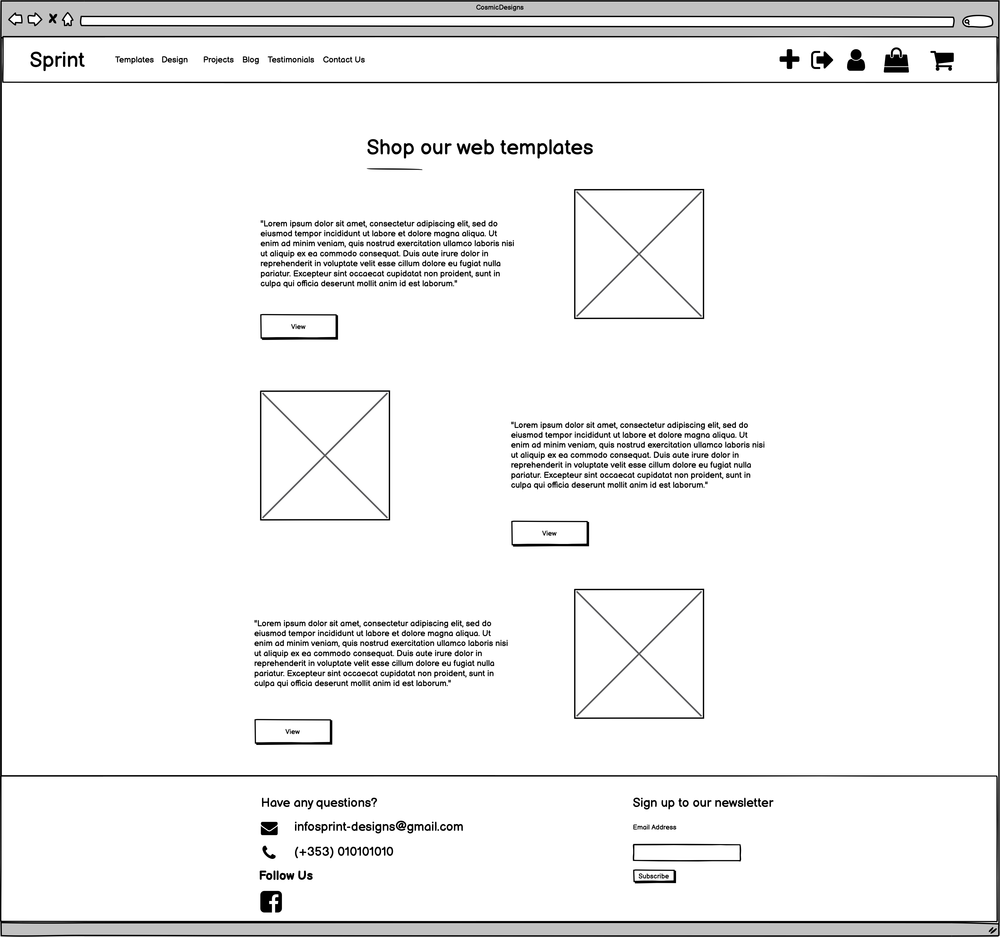

# Testing

## Manual Testing

### Superuser / Admin
- **As a Site Owner, I want to be able to add, update and delete products from the store.**
    - Products can be added via the django admin panel or by clicking the "+" icon in the navigation menu and filling in the add product form. When the user has provided the correct data, a new model instance is created and the user is redirected to the new product, followed by a success message that the new product has been created.

    - Products can be deleted by clicking the delete product button below the product description. When the product has been successfully deleted, a message will appear to notify the user that the product was deleted and the model instance is removed from the database and the user is redirected to the products page.

    - Products can be edited/updated by clicking the edit product button below the product description. The user is brought to the edit product form where they can update the product information. Once the product is updated a success message is displayed to the user is redirected to the individual product.

- **As a Site Owner, I want to be able to add, update and delete recent projects.**
    - Projects can be added by following the Add Project link on the projects archive page. When the user has provided the correct data, a new model instance is created and the user is redirected to the projects archive page, followed by a success message that the new project has been created.

    - Projects can be edited/updated by clicking the edit project button below the project description. The user is brought to the edit project form where they can update the project information. Once the project is updated a success message is displayed to the user is redirected to the projects archive page.

    - Projects can be deleted by clicking the delete project button below the project description. When the project has been successfully deleted, a message will appear to notify the user that the project was deleted and the model instance is removed from the database and the user is redirected to the projects archive page.

- **As a Site Owner, I want to be able to add, update and delete blog posts.**

    - Blogs can be added by admin users by clicking the Add Blog button on the blogs archive page. When the user has provided the correct data, a new model instance is created and the user is redirected to the blogs archive page, followed by a success message that the new blog has been created.

    - Blogs can be updated by clicking the delete blog button below the blog content. When the blog has been successfully deleted, a message will appear to notify the user that the blog was deleted and the model instance is removed from the database and the user is redirected to the blog archive page.

    - Blogs can be deleted by clicking the delete blog button below the blog content. When the blog has been successfully deleted, a message will appear to notify the user that the blog was deleted and the model instance is removed from the database and the user is redirected to the blogs archive page.

- **As a Site Owner, I want to be able to view all reviews when viewing a product, so that I can delete reviews if needed.**

    - Admin users have access to the delete review button for all reviews and choose whether or not they would like to remove a review created by another user.

#### Registered User
- **As a User, I want to be able to view my account profile, so that I can look at my purchase/order history.**

    - When the user is signed in and clicks the user icon in the navigation menu they will be brought to their own unique user profile. The user profile page was tested to see if orders would display in the users order history.

- **As a User, I want to be able to register for an account, so that I can store my details.**

    - The user sign up form was tested by entering invalid data into the forms input fields. Incorrect data such as passwords not matching would display an error message to the user.

    - Users who have filled in the sign up form correctly will then be told to verify their email address. Once the user verifies their email address they will be asked to sign in again.

- **As a User, I want to be able to add a review to a product that I have purchased, so that I can share my feedback.**

    - Registered users gain access to the review form for each product on the site. The review form was tested by filling the form with data and clicking the submit button. A new model instance is created when a user has successfully added a review and a success message appears to notify the user that the form submission was successful.

    - Users who have not registered for an account cannot view the review form and will be asked to log in to their account to add a review.

### Default User
- **As a User, I want to be able to view a list of products, so that I can add them to my shopping bag.**

    - All products are displayed using Bootstrap columns and responsive CSS to ensure that each product is displayed with its description and image side-by-side.

    - The products page was also tested by creating a product without uploading an image. The result is that the product uses the default product image.

- **As a User, I want to be able to view an individual product on it's own page, so that I can read the information about the product more clearly.**

    - The individual product page was tested by clicking the more info button attached to each product on the products page. The result is that the user is then brought to a page that displays the product image, title, category, description, and price.

- **As a User, I want to view a error page if I visit a page that does not exist on the site, so that I know to head back to an existing page on the site.**

    - The error page was tested by visiting a page on the site that does not exist. The result is that a message is displayed to the user notifying them that they have visited a page that does not exist and a button to take them back to the homepage.

- **As a User, I want to be able to sign up to a newsletter, so that I can keep up to date with the business.**

    - The mailchimp newsletter signup form was tested by adding an email to the form and clicking the subscribe button. The result is that a new contact is added to the list of contacts in the mailchimp account.

- **As a User, I want to be able to make an order without needing to create an account, so that I can make one off orders.**

    - The above user story was tested by making a purchase without being logged into an account. The result is that the user is brought to the checkout success page and an email is sent to them with their order details.

- **As a User, I want to view a projects page, so that I can view the past work completed by the business.**

    - The projects page user story was tested by viewing the projects archive page. The result is that eah project is displayed in its own column using the bootstrap responsive grid system.

- **As a User, I want to be able to view my shopping bag so that I can add or remove any items.**

    - The above user story was tested by adding multiple products to the shopping bag and then viewing the shopping bag. The result is that the user is able to view all the items that they have added to their shopping bag, and can choose if they would like to remove items from their shopping bag.

    - The user story was also tested by viewing the shopping bag without having added any items. The result is a message to notify the user that their bag is empty and that they can view store products by clicking either the "Shop our templates", or "Shop our designs" links.

- **As a User, I want to view a contact page, so that I can get in touch with the business directly.**

    - The contact page was tested by clicking the "Contact Us" link in the main site navigation menu. The result is that the user is brought to the contact page where they have access to contact details.

- **As a User, I want to view testimonials, so that I can add a new testimonial and read about other peoples experience.**

    - The testimonials user story was tested by filling in the required information into the add testimonial form. The result is that a new testimonial is added to the testimonial slider on the homepage.

    - If a user does not enter the required information into the add testimonial form, an alert message will display to let the user know that the must enter a value into the required input fields.

- **As a User, I want to view blog posts, so that I can read the blogs posted by the company.**

    - The blog posts user story was tested by visiting the blog posts archive page. The result is that all blog posts are displayed using the bootstrap responsive grid system.

- ### W3C Validator

    *[W3C Validator](https://validator.w3.org/) was used to ensure that there are no errors in any of the html markup.

- ### Pep8 Validator

    * All files with the .py file extension were tested using the pycodestyle linter to ensure that the code is clean and follows best practices.

- ### Jigsaw Validator

    * [Jigsaw Validator](https://jigsaw.w3.org/css-validator/) was used to validate all css style sheets.

- ### JS Hint

    *[JS Hint](https://jshint.com/) was used to validate all JavaScript files.

- ### Bugs

    - For loop counter layout. Originally, the templates and designs products pages were supposed to have a layout where every second product would have a flipped version of the product layout. To try and achieve this layout I used the forloop.counter built-in template tag to check if the for loop counter was an even number. The result was that the for loop indexing was causing the product images to display beside the incorrect product information.

    - **Originally intended layout:**
    

## Automated Testing

- ### Fixed Bugs